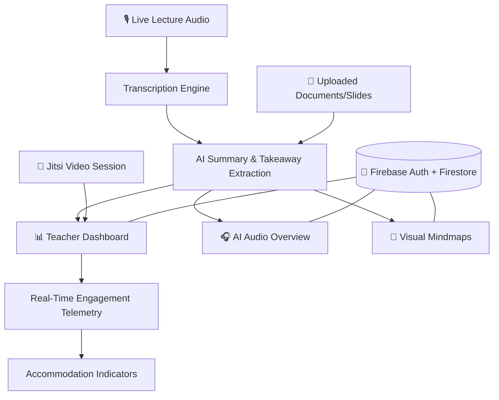

<div align="center">

# 🎓 EduMonitor Hub

### Accessibility-first classroom intelligence — so no student learns alone.

*Real-time engagement telemetry, automated lesson transformation, and multi-modal study tools — built for neurodivergent learners, ESL students, and everyone in between.*

[](#)
[](#)
[](#)
[](#)
[](#license)

<br/>

<sub>⚠️ Replace badge links, screenshots, and repo URLs with your own before publishing.</sub>

</div>

<br/>

## 📖 Table of Contents

- [Overview](#-overview)
- [How It Empowers Teachers](#-how-it-empowers-teachers)
- [How It Empowers Students](#-how-it-empowers-students)
- [Feature Suite](#️-feature-suite)
- [Architecture](#-architecture)
- [Tech Stack](#-tech-stack)
- [Getting Started](#-getting-started)
- [Roadmap](#-roadmap--visionary-features)
- [Elevator Pitch](#-elevator-pitch)
- [Contributing](#-contributing)
- [License](#-license)

<br/>

## 🌟 Overview

**EduMonitor Hub** is an accessibility-first inclusive classroom intelligence and learning platform. It bridges the gap between general classroom instruction and specialized accommodations — for neurodivergent learners, ESL students, and learners with ADHD, dyslexia, or auditory processing needs — through **real-time engagement telemetry**, **automated lesson transformation**, and **multi-modal study tools**.

> No student should fall through the cracks because a lesson only came in one format.

<br/>

## 👨‍🏫 How It Empowers Teachers

| Capability | What It Means in the Classroom |
|---|---|
| 🔍 **Discreet Real-Time Comprehension & Focus Tracking** | See which students are falling behind or losing focus — without singling anyone out in front of the class |
| 🎯 **Accommodation Visual Indicators** | Instantly surfaces each student's needs (extra time, visual cues, sensory breaks) |
| 📝 **Automated Lesson Transcription** | Live lectures are transcribed, key takeaways extracted, and review materials generated automatically — no more hours spent writing summary notes |
| 🎥 **Integrated Video Classroom** | Built-in Jitsi meetings for remote/hybrid teaching, with synchronized student status |
| 📊 **Data-Backed IEP & 504 Compliance** | Centralizes accommodation profiles, making compliance documentation effortless |

<br/>

## 🎓 How It Empowers Students

| Capability | What It Means for the Learner |
|---|---|
| 🎨 **Neurodivergent-Friendly UI** | Toggle dyslexia-friendly typography, high-contrast modes, bionic reading, and cognitive-load reducers |
| 🎧 **AI Audio Overviews** | Podcast-style recaps of any lesson or document, for students who struggle with dense reading |
| 🧠 **Visual Mindmaps & Chunked Summaries** | Prevents cognitive overload by breaking lessons into digestible pieces |
| ⏱️ **Low-Anxiety, Self-Paced Review** | Every lecture and material is archived with timestamped notes, so students can revisit tough concepts at their own pace |

<br/>

## 🛠️ Feature Suite

| Module | Description |
|---|---|
| 📡 **Inclusive Classroom Dashboard** | Live telemetry: attendance, engagement score, active accommodations, period-by-period schedule |
| 🎙️ **Live Lecture Recording & Transcriber** | Real-time audio capture → automatic transcription → synthesized takeaways and action items |
| 🎧 **AI Audio Overview Engine** | Converts uploaded notes/documents into conversational audio podcasts and executive summaries |
| 📂 **Multi-Modal Content Uploader** | Ingests PDFs, slides, and text docs, breaking them into digestible learning modules |
| ♿ **Accessibility Toolkit & Directory** | Quick-switch aids: dyslexia fonts, contrast tuners, text magnification, focus rulers |
| 📹 **Live Video Meeting Hub** | One-click encrypted virtual classroom sessions with persistent status tracking |
| 🔐 **Role-Protected Cloud Architecture** | Secure Firebase auth + per-teacher isolated Firestore data storage |

<br/>

## 🏗️ Architecture



Lectures and documents flow into a shared AI processing layer, which fans content out into whatever format each student needs — audio, visual, or text — while the teacher dashboard tracks engagement and accommodations in real time, all on a per-teacher isolated, role-protected data store.

<br/>

## 🧰 Tech Stack

<div align="center">

| Layer | Technology |
|---|---|
| **Auth & Data** | Firebase Authentication + Firestore (per-teacher isolated) |
| **Video** | Jitsi Meet (embedded, encrypted) |
| **Transcription / AI** | Speech-to-text + LLM summarization pipeline |
| **Audio Generation** | Conversational AI audio overview engine |
| **Frontend** | Accessibility-first UI (dyslexia fonts, high-contrast, bionic reading) |

</div>

<br/>

## 🚀 Getting Started

```bash
# Clone the repository
git clone https://github.com/<your-username>/edumonitor-hub.git
cd edumonitor-hub

# Install dependencies
npm install

# Configure environment
cp .env.example .env
# Add your Firebase config, Jitsi domain, and AI/transcription API keys

# Run the app
npm run dev
```

<sub>Adjust these commands to match your actual project structure (Node/Python/etc.).</sub>

<br/>

## 🗺️ Roadmap — Visionary Features

Concepts that push the platform toward a full adaptive-education ecosystem:

- [ ] 🧠 **Real-Time Cognitive Fatigue & "Smart Break" Triggers** — detects attention drop-off and suggests a 60-second break before burnout hits, targeting up to 40% better retention
- [ ] ⚡ **Dynamic Adaptive Quizzing** — auto-generates 3-question formative quizzes per period, reformatted per learning style (visual, simplified language for ESL, etc.)
- [ ] 🌐 **Instant Multi-Language Live Subtitles & Accent Harmonizer** — real-time translation into 30+ languages with glossary tooltips for academic vocabulary
- [ ] 📊 **Automated IEP & Parent-Teacher Progress Co-Pilot** — one-click weekly progress reports, saving educators 5–10 hours/week
- [ ] 🎮 **Gamified Sensory & Focus Companion** — a quiet digital focus companion offering pacing cues, built for ADHD self-regulation

<br/>

## 💡 Elevator Pitch

> *EduMonitor Hub is the next-generation inclusive classroom platform that ensures no student is left behind. By combining real-time classroom telemetry, AI-powered multi-modal study aids, and instant accessibility adaptations, it empowers teachers to teach effortlessly while giving every learner — regardless of learning style or neurodiversity — a personalized path to academic success.*

<br/>

## 🤝 Contributing

Contributions, issues, and feature requests are welcome!

1. Fork the project
2. Create your feature branch (`git checkout -b feature/amazing-feature`)
3. Commit your changes (`git commit -m 'Add amazing feature'`)
4. Push to the branch (`git push origin feature/amazing-feature`)
5. Open a Pull Request

<br/>

## 📄 License

Distributed under the **MIT License**. See `LICENSE` for more information.

<br/>

<div align="center">

### 🌟 Built so every student gets a path to learning that actually fits them.

**If this project resonates with you, consider giving it a ⭐!**

</div>
